# Tema 1.2 · Capacidades y mecanismos de ejecución de código de los navegadores Web

## Actividades

### Ejercicio 1 — Segundo botón que modifica también el `<h1>`

Añadir un segundo botón al ejemplo de los apuntes que, al pulsarlo, no solo altere el párrafo sino que cambie también el texto del encabezado `<h1>` mediante `document.getElementById()` e `innerHTML`.

```html
<!-- El h1 necesita un id para poder localizarlo desde JavaScript -->
<h1 id="titulo">Modificando el código HTML</h1>
<p id="prueba">Modificando el contenido.</p>

<button type="button" onclick="document.getElementById('prueba').innerHTML = 'CAMBIANDO el contenido!'; console.log('[Ej1] Párrafo actualizado.')">
  ¡Dale! (párrafo)
</button>
<button type="button" onclick="document.getElementById('titulo').innerHTML = '¡TÍTULO cambiado!'; console.log('[Ej1] Encabezado h1 actualizado.')">
  ¡Dale! (encabezado)
</button>
```

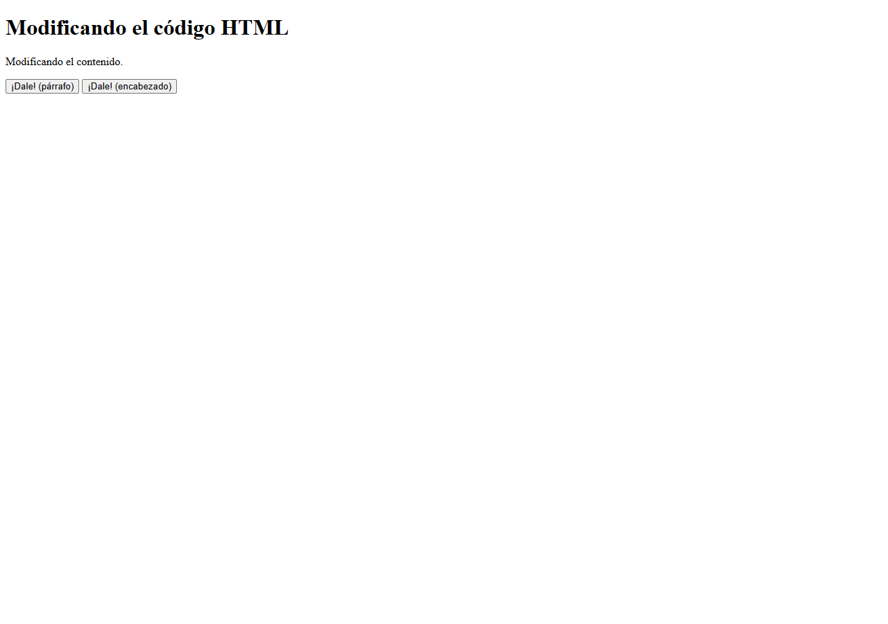

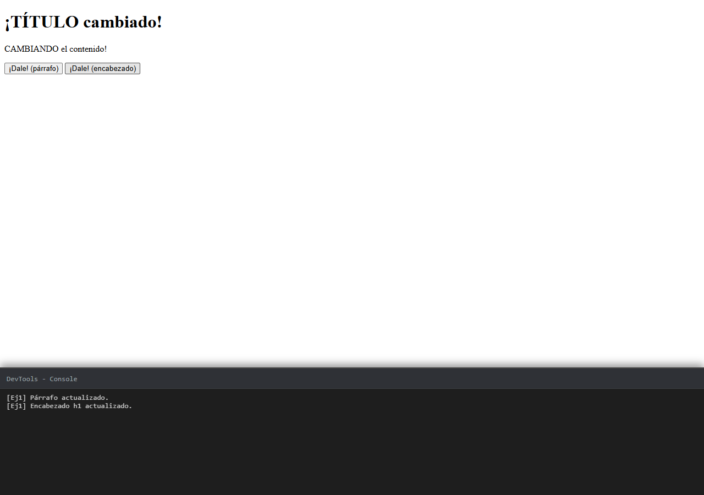

---

### Ejercicio 2 — Evento clic de un botón con una traza por consola

Capturar el evento `clic` de un botón para emitir una traza informativa mediante `console.log()`, usando `addEventListener()` en lugar del atributo `onclick`.

```js
// addEventListener separa el comportamiento del HTML y admite varias escuchas.
document.getElementById('btn').addEventListener('click', function () {
  // console.log() solo escribe en la consola; no altera la página.
  console.log('Se ha capturado el evento clic del botón.');
});
```

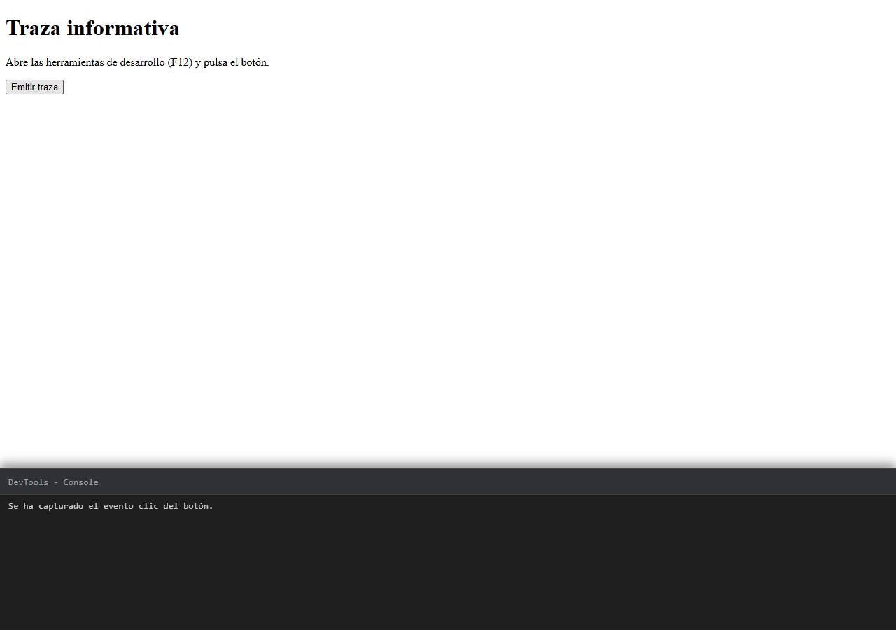

---

### Ejercicio 3 — Aviso emergente modal con `window.alert()`

Modificar el ejercicio 2 sustituyendo la escritura en la consola por una ventana de aviso emergente modal con `window.alert()`.

```js
document.getElementById('btn').addEventListener('click', function () {
  // window.alert() abre un cuadro MODAL que bloquea la interacción con la
  // página hasta que el usuario lo confirma.
  window.alert('Clic capturado: se muestra una ventana emergente modal.');
});
```

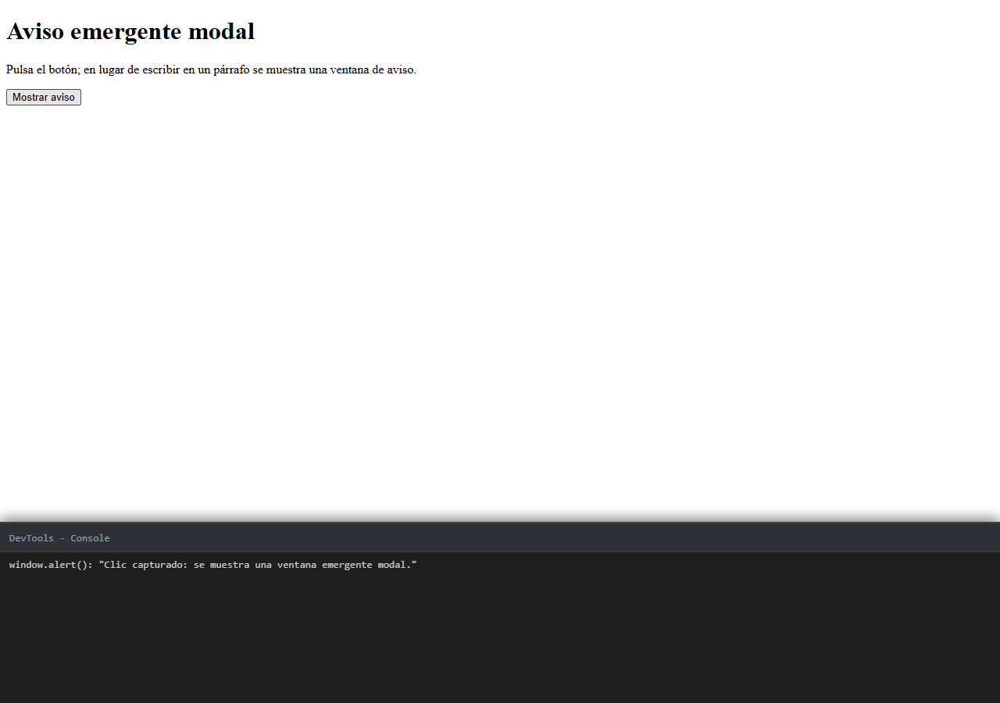

Al pulsar «Mostrar aviso» se abre el cuadro modal nativo del navegador con el texto *"Clic capturado: se muestra una ventana emergente modal."* (comprobado en ejecución; el recuadro bloquea la interacción hasta confirmarlo).

---

### Ejercicio 4 — Saludo multidioma con un color de fuente distinto por idioma

Web con tres botones ("Ruso", "Español", "Inglés") que alteren un `<p>` mostrando el saludo en el idioma elegido y un color de fuente CSS distinto para cada idioma mediante `.style.color`.

```js
const saludos = {
  ru: { texto: 'Привет!', color: 'purple' },
  es: { texto: '¡Hola!', color: 'green' },
  en: { texto: 'Hello!', color: 'blue' }
};

function saludar(idioma) {
  const p = document.getElementById('saludo');
  p.innerHTML = saludos[idioma].texto;   // contenido del párrafo
  p.style.color = saludos[idioma].color; // color de fuente en línea
  console.log('[Ej4] Idioma: ' + idioma + ' · saludo: ' + saludos[idioma].texto + ' · color: ' + saludos[idioma].color);
}
```

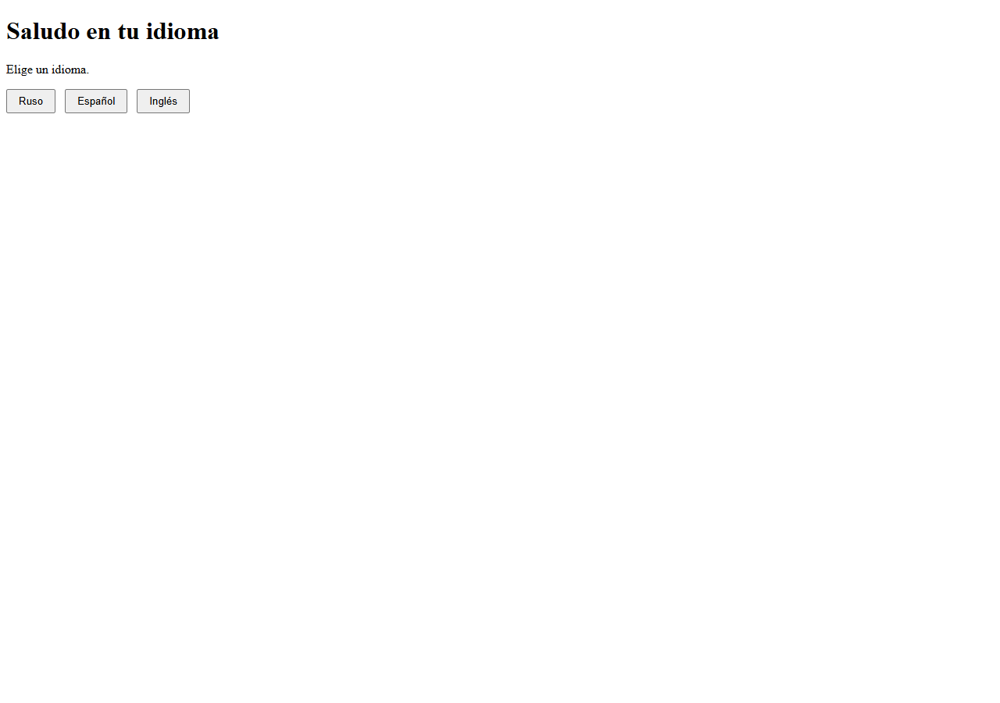

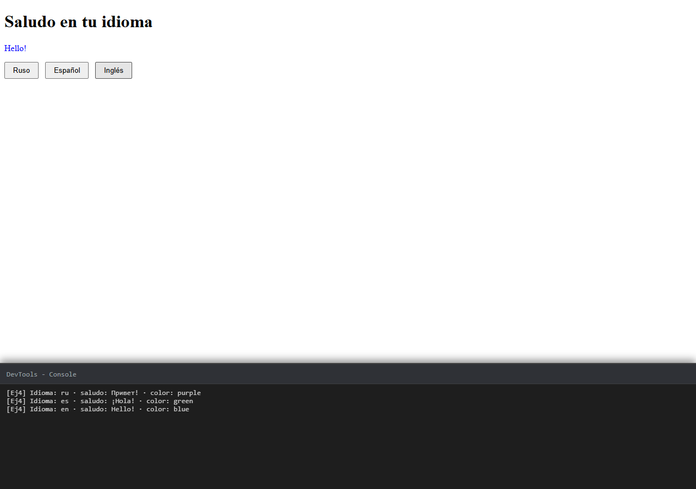

---

### Ejercicio 5 — Salidas multidioma solo por consola

Adaptar el ejercicio 4 para que las salidas en los tres idiomas se impriman únicamente a través de la consola del desarrollador, sin modificar la página.

```js
// Solo consola: no modifica el DOM, escribe el saludo y su color en F12.
function saludar(idioma) {
  const s = saludos[idioma];
  console.log(s.texto + ' (color sugerido: ' + s.color + ')');
}
```

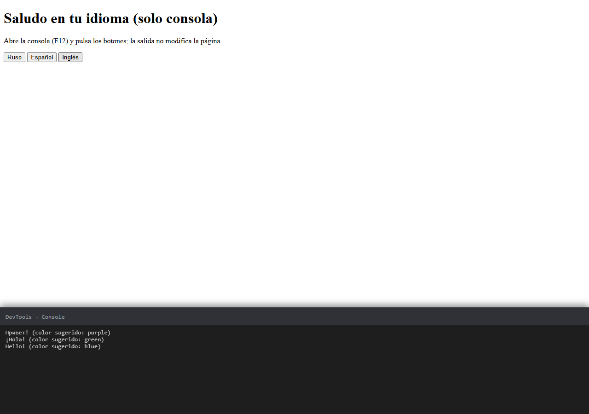

---

### Ejercicio 6 — Salida directa en el flujo de la página con `document.write()`

Transformar el código de los saludos para generar los textos directamente en el flujo de la página mediante `document.write()`.

```js
const saludos = { ru: 'Привет!', es: '¡Hola!', en: 'Hello!' };

// document.write() tras la carga reabre el flujo y SUSTITUYE todo el
// contenido de la página por el texto generado. Por eso, al pulsar un
// botón, los botones y el párrafo desaparecen.
function saludar(idioma) {
  document.write('<h1>' + saludos[idioma] + '</h1>');
}
```

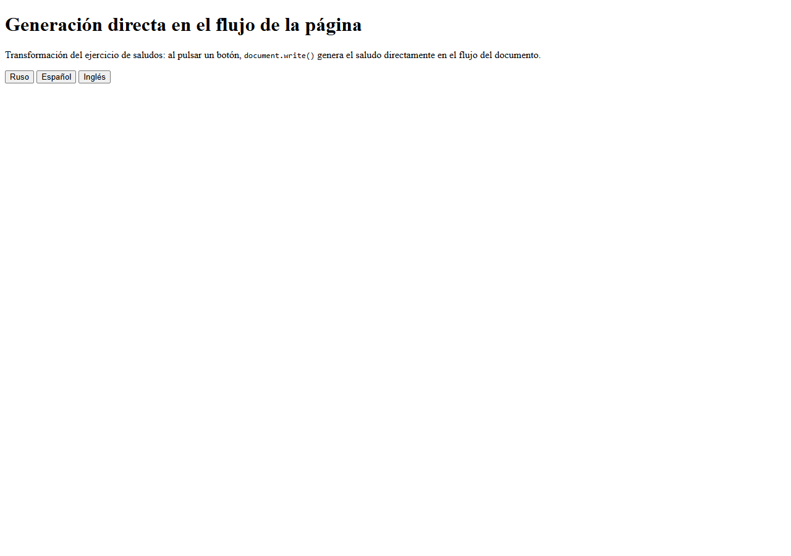

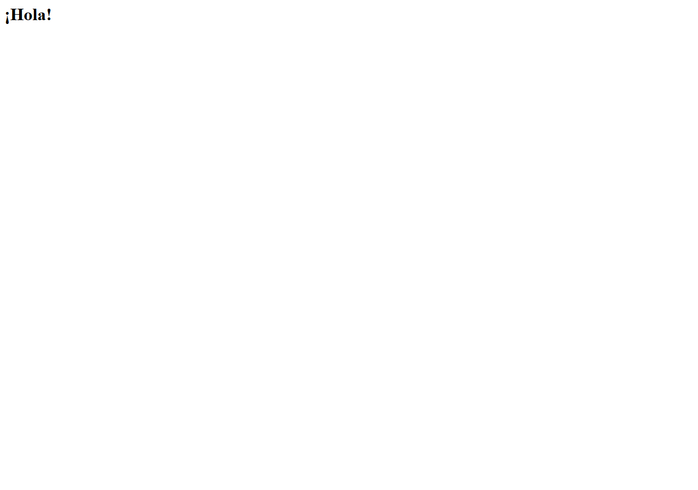

---

### Ejercicio 7 — Interfaz con tres botones: consola, estilo y alerta

Diseñar una interfaz con un `<h1>`, un `<p id="estado">` y tres botones: uno que emita la hora del sistema por consola, otro que cambie el fondo del párrafo a verde con el texto «Sistema Activo», y un tercero que muestre un aviso modal de fin de proceso.

```js
const estado = document.getElementById('estado');

// Botón 1: traza con la hora del sistema.
function consola() {
  console.log('Hora del sistema: ' + new Date().toLocaleTimeString());
}

// Botón 2: cambia el texto y el fondo del párrafo de estado.
function estilo() {
  estado.innerHTML = 'Sistema Activo';            // contenido
  estado.style.backgroundColor = 'green';         // fondo (camelCase)
}

// Botón 3: ventana emergente modal de aviso.
function alerta() {
  window.alert('El proceso ha concluido.');
}
```

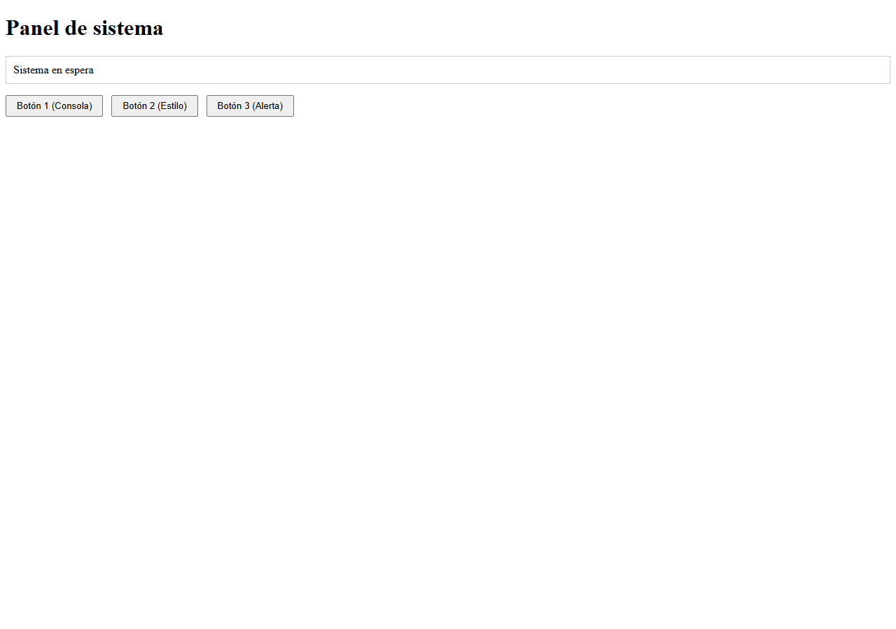

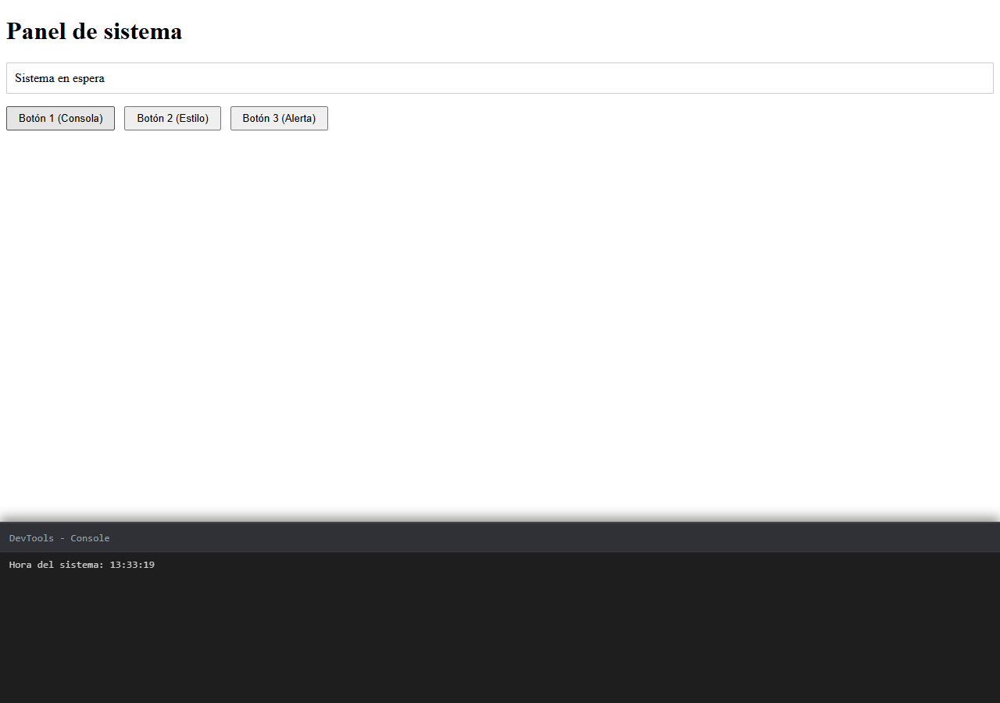

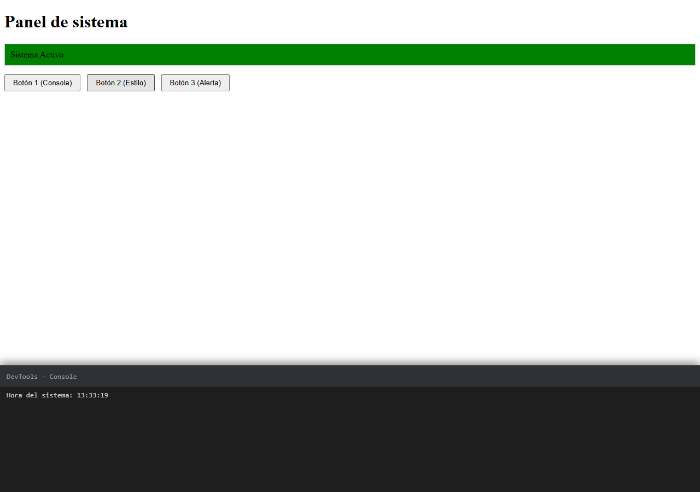

Al pulsar el botón 3 se abre el modal **"El proceso ha concluido."** (comprobado en ejecución).

---

### Ejercicio 8 — Test interactivo de Verdadero/Falso evaluado en el cliente

Desarrollar un test de siete preguntas con botones "Verdadero" y "Falso". Al hacer clic, el script evalúa el acierto y modifica `.style.color` a `green` (acierto) o `red` (error).

```js
// Solución correcta de las 7 preguntas (en el mismo orden que el HTML).
const respuestas = [true, false, true, true, true, true, true];

// Evalúa la respuesta y colorea el bloque según el acierto.
function responder(numero, ganaBoton) {
  const esAcierto = (respuestas[numero - 1] === ganaBoton);
  const div = document.getElementById('pregunta' + numero);
  div.style.color = esAcierto ? 'green' : 'red';
  console.log('[Ej8] Pregunta ' + numero + ': ' + (esAcierto ? 'ACIERTO' : 'ERROR'));
}
```

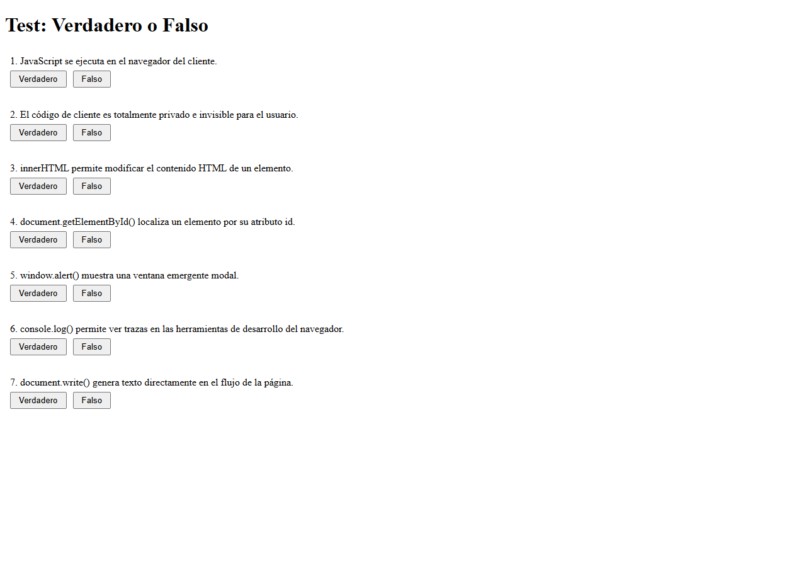

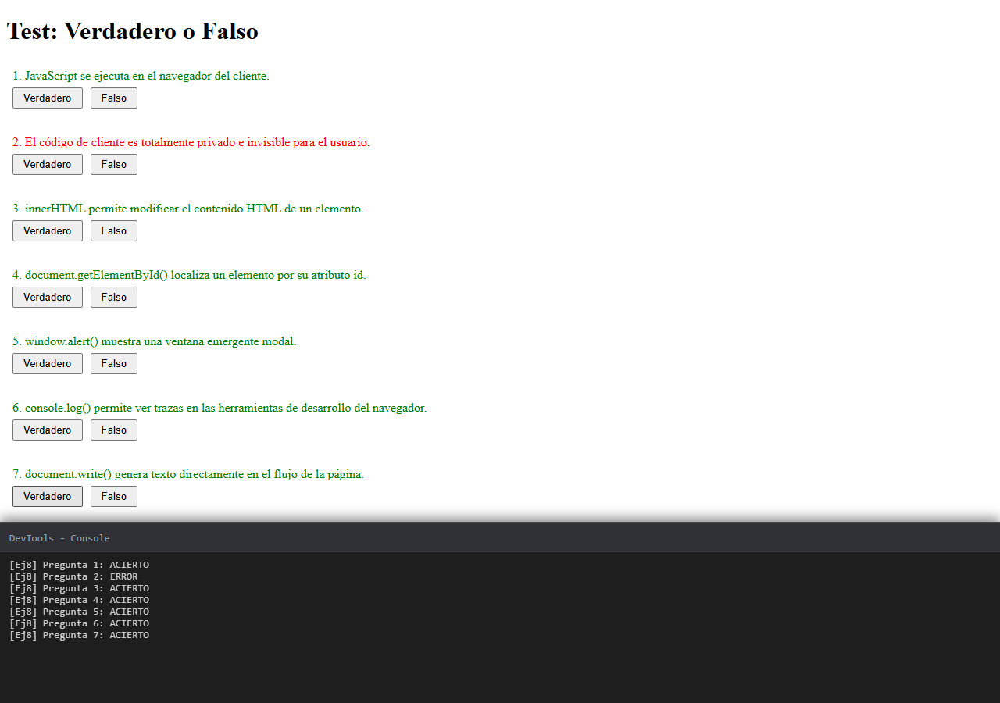

---

### Ejercicio 9 — Secuencia cíclica de imágenes fotograma a fotograma

Crear una secuencia cíclica de al menos 4 imágenes. Al hacer clic, el script reasigna `.src` para mostrar el siguiente fotograma y vuelve al primero al llegar al final.

```js
// Imágenes en formato data: (SVG autocontenido, sin archivos externos).
const colores = ['red', 'green', 'blue', 'orange'];
const imagenes = colores.map(function (color, i) {
  return 'data:image/svg+xml;utf8,' + encodeURIComponent(
    '<svg xmlns="http://www.w3.org/2000/svg" width="240" height="150">' +
    '<rect width="240" height="150" fill="' + color + '"/>' +
    '<text x="120" y="85" font-size="40" fill="white" text-anchor="middle">' + (i + 1) + '</text>' +
    '</svg>'
  );
});

let indice = 0;
const foto = document.getElementById('foto');
const pie = document.getElementById('pie');
foto.src = imagenes[0]; // primer fotograma al cargar

// Reasigna .src al siguiente fotograma; % vuelve al inicio (bucle).
function siguiente() {
  indice = (indice + 1) % imagenes.length;
  foto.src = imagenes[indice];
  pie.innerHTML = 'Fotograma ' + (indice + 1) + ' de ' + imagenes.length;
  console.log('[Ej9] Fotograma ' + (indice + 1) + ' de ' + imagenes.length + ' · índice: ' + indice);
}

foto.addEventListener('click', siguiente);
```

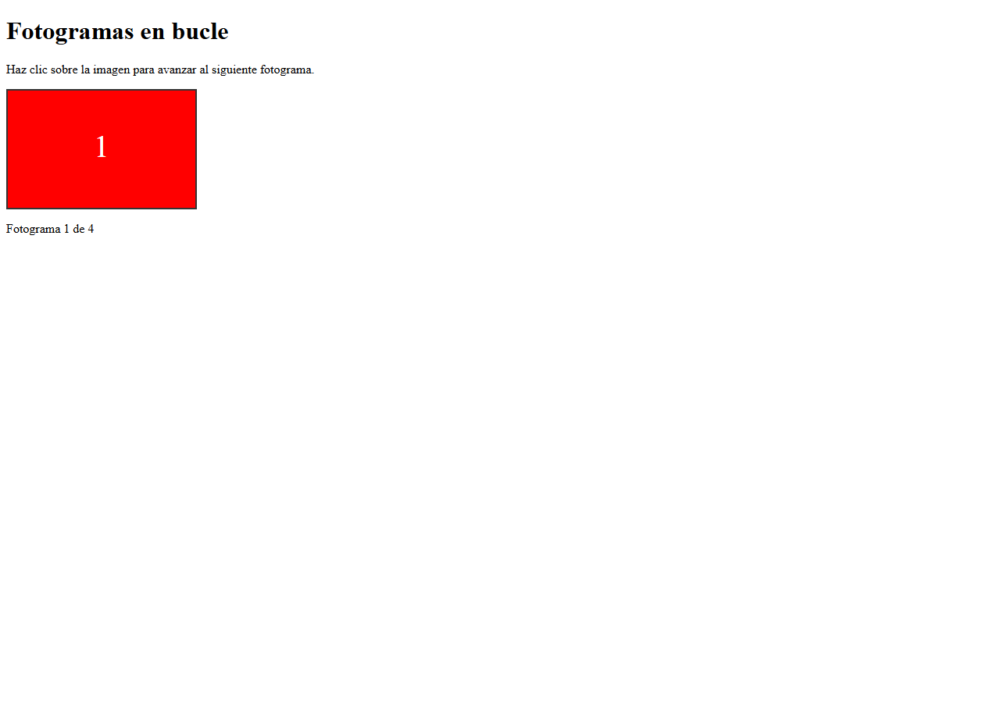

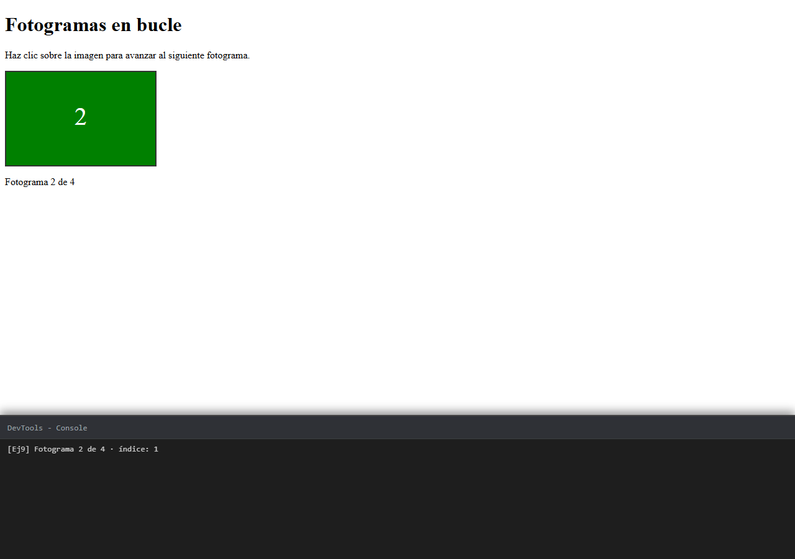

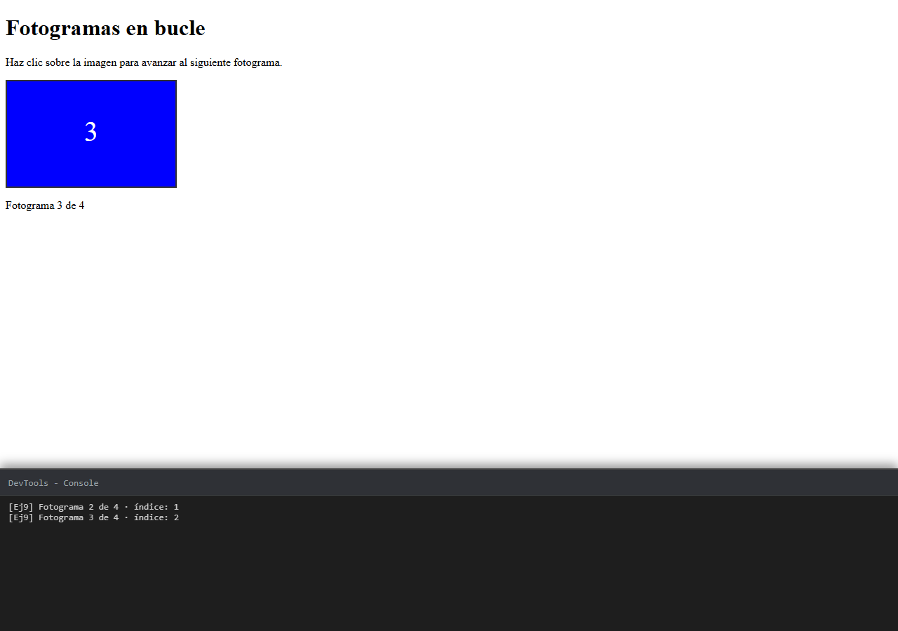