# Tema 1.3 · Identificación y caracterización de los principales lenguajes relacionados con la programación de clientes Web

## Actividades

### Ejercicio 1 — Segundo botón que modifica también el `<h1>`

Repetir el ejercicio 1 del Tema 1.2 separando el comportamiento en funciones: un botón llama a `cambiarParrafo()` y el otro a `cambiarTitulo()`, en lugar de llevar el código dentro del atributo `onclick`.

```html
<button type="button" onclick="cambiarParrafo()">¡Dale! (párrafo)</button>
<button type="button" onclick="cambiarTitulo()">¡Dale! (encabezado)</button>
```

```js
// Ejercicio 1 - Los dos botones del 1.2·1, cada uno en su función

// Cambia el contenido del párrafo.
function cambiarParrafo() {
  document.getElementById('prueba').innerHTML = 'CAMBIANDO el contenido!';
  console.log('[Ej1] Párrafo actualizado');
}

// Cambia el texto del encabezado h1.
function cambiarTitulo() {
  document.getElementById('titulo').innerHTML = '¡TÍTULO cambiado!';
  console.log('[Ej1] Encabezado actualizado');
}
```

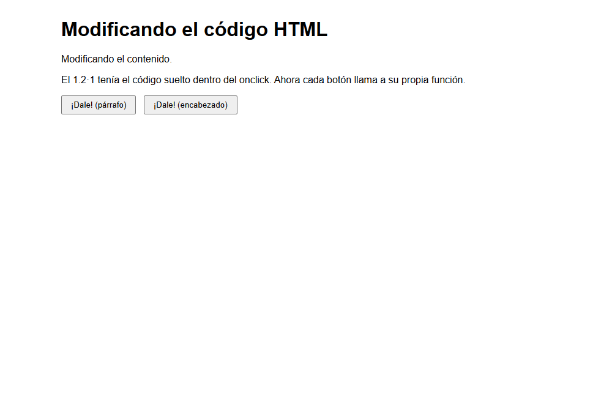

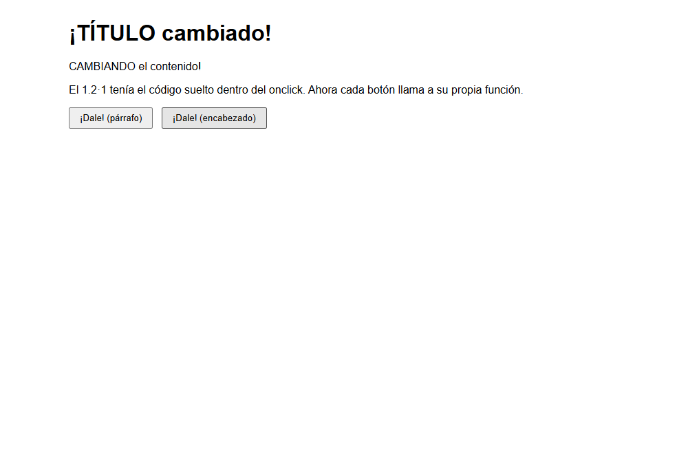

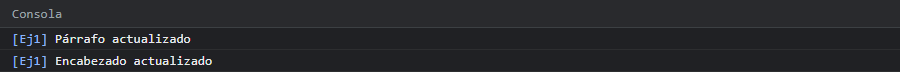

### Ejercicio 2 — Evento clic de un botón con una traza por consola

Capturar el evento clic de un botón dentro de una función para emitir una traza informativa mediante `console.log()`, sin modificar el contenido de la página.

```html
<button type="button" onclick="emitirTraza()">Emitir traza</button>
```

```js
// Ejercicio 2 - El clic del 1.2·2 dentro de una función

// console.log() solo escribe en la consola, no toca la página.
function emitirTraza() {
  console.log('Se ha capturado el evento clic del botón.');
}
```

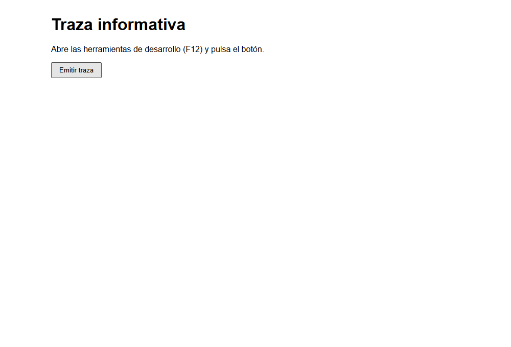

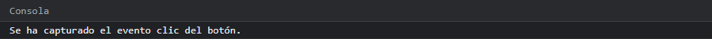

### Ejercicio 3 — Aviso emergente modal con `window.alert()`

Sustituir la escritura en la consola por una ventana modal, guardando la llamada a `window.alert()` dentro de una función `mostrarAviso()`.

```html
<button type="button" onclick="mostrarAviso()">Mostrar aviso</button>
```

```js
// Ejercicio 3 - El alert() del 1.2·3 dentro de una función

// window.alert() abre un cuadro MODAL: bloquea la página hasta que se confirma.
function mostrarAviso() {
  window.alert('Clic capturado: se muestra una ventana emergente modal.');
}
```

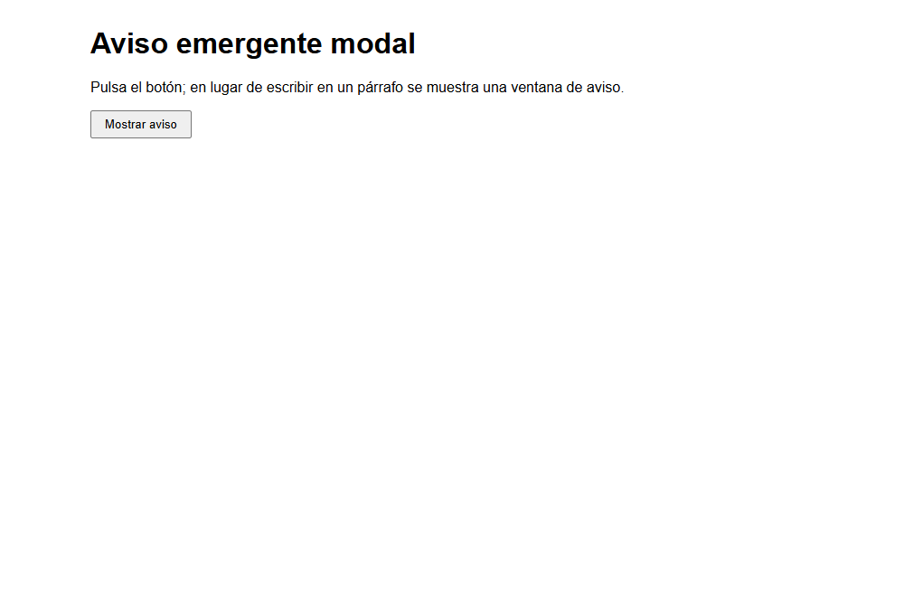

Al pulsar el botón se abre el recuadro modal del navegador con el texto «Clic capturado: se muestra una ventana emergente modal». El recuadro no se puede capturar en una imagen porque lo dibuja el propio navegador, y bloquea la página hasta que se confirma.

### Ejercicio 4 — Saludo multidioma con un color de fuente distinto por idioma

Tres botones que muestran un saludo en ruso, español o inglés cambiando el color de la fuente. La tabla de saludos se declara fuera y una única función `saludar(idioma)` recibe el idioma como parámetro, de modo que los tres botones comparten el mismo comportamiento.

```html
<button type="button" onclick="saludar('ru')">Ruso</button>
<button type="button" onclick="saludar('es')">Español</button>
<button type="button" onclick="saludar('en')">Inglés</button>
```

```js
// Ejercicio 4 - El saludo multidioma del 1.2·4 usando una función

// Tabla de saludos: texto y color CSS para cada idioma.
const saludos = {
  ru: { texto: 'Привет!', color: 'purple' },
  es: { texto: '¡Hola!', color: 'green' },
  en: { texto: 'Hello!', color: 'blue' }
};

// El idioma llega como parámetro, así que la misma función sirve para los tres botones.
function saludar(idioma) {
  const p = document.getElementById('saludo');
  p.innerHTML = saludos[idioma].texto;   // contenido del párrafo
  p.style.color = saludos[idioma].color; // color de fuente en línea
  console.log('[Ej4] Idioma: ' + idioma + ' · saludo: ' + saludos[idioma].texto);
}
```

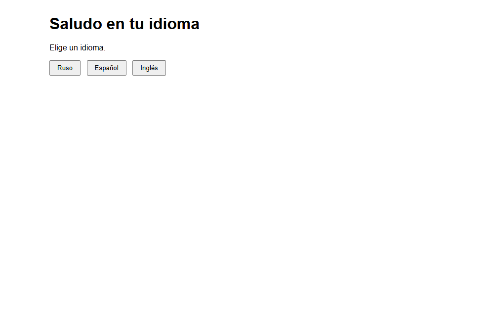

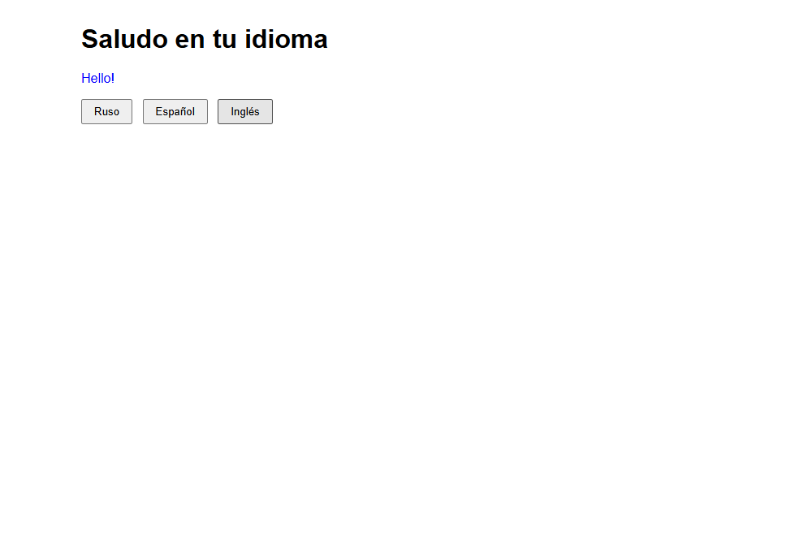

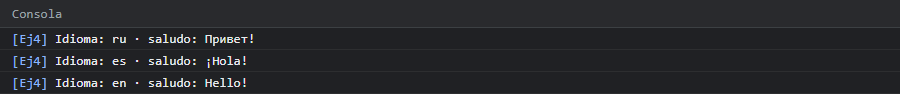

### Ejercicio 5 — Salidas multidioma solo por consola

Repetir el ejercicio 4 con la misma tabla de saludos, pero sin tocar el DOM: la función `saludar(idioma)` escribe directamente en la consola el saludo y el color que le correspondería.

```html
<button type="button" onclick="saludar('ru')">Ruso</button>
<button type="button" onclick="saludar('es')">Español</button>
<button type="button" onclick="saludar('en')">Inglés</button>
```

```js
// Ejercicio 5 - El saludo del 1.2·5 con funciones, solo por consola

// Tabla de saludos: texto y color CSS para cada idioma.
const saludos = {
  ru: { texto: 'Привет!', color: 'purple' },
  es: { texto: '¡Hola!', color: 'green' },
  en: { texto: 'Hello!', color: 'blue' }
}

// Esta versión no toca el DOM: solo escribe en la consola del desarrollador.
function saludar(idioma) {
  const s = saludos[idioma];
  console.log(s.texto + ' (color sugerido: ' + s.color + ')');
}
```

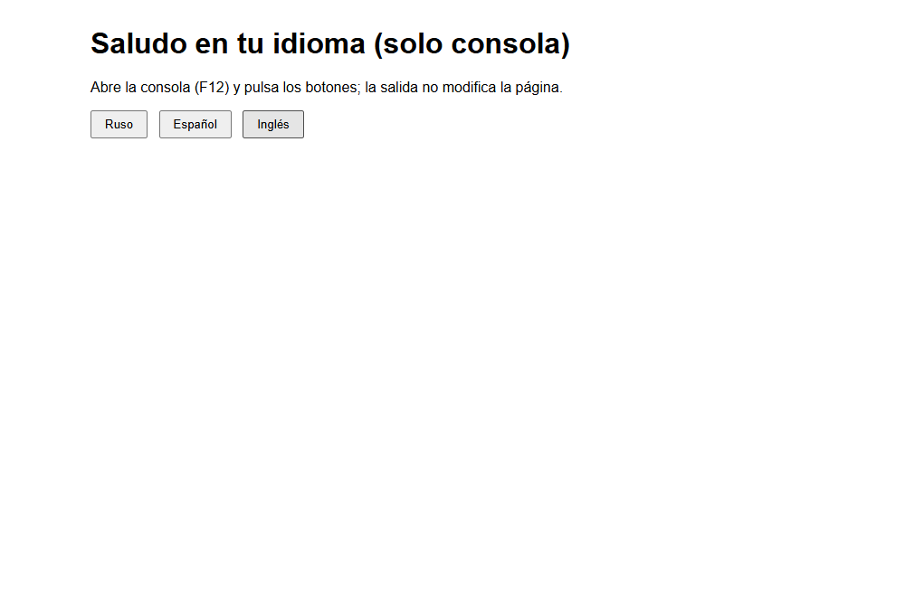

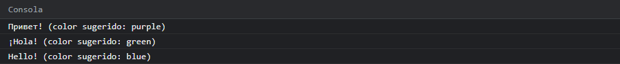

### Ejercicio 6 — Salida directa en el flujo de la página con `document.write()`

Generar el saludo multidioma directamente en el flujo de la página. La función `saludar(idioma)` llama a `document.write()` con una etiqueta `<h1>`, lo que reabre el documento y sustituye todo el contenido de la página.

```html
<button type="button" onclick="saludar('ru')">Ruso</button>
<button type="button" onclick="saludar('es')">Español</button>
<button type="button" onclick="saludar('en')">Inglés</button>
```

```js
// Ejercicio 6 - El document.write() del 1.2·6 dentro de una función

// Tabla de saludos: solo el texto, aquí no hace falta el color.
const saludos = {
  ru: 'Привет!',
  es: '¡Hola!',
  en: 'Hello!'
}

// document.write() tras la carga reabre el flujo y SUSTITUYE todo el contenido
// de la página. Por eso al pulsar, los botones desaparecen.
function saludar(idioma) {
  document.write('<h1>' + saludos[idioma] + '</h1>');
}
```

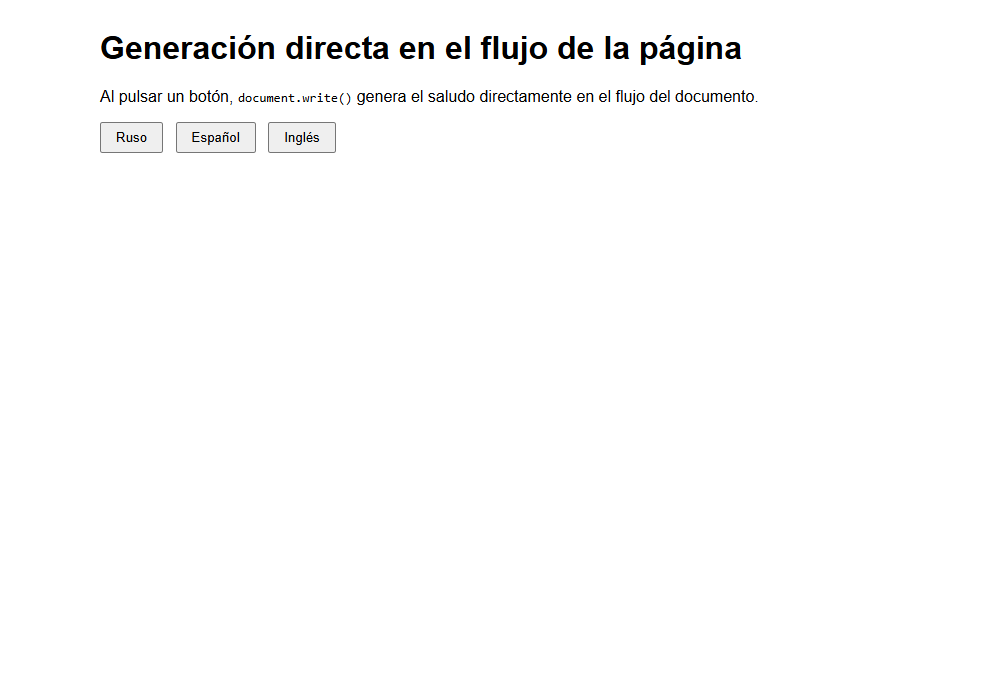

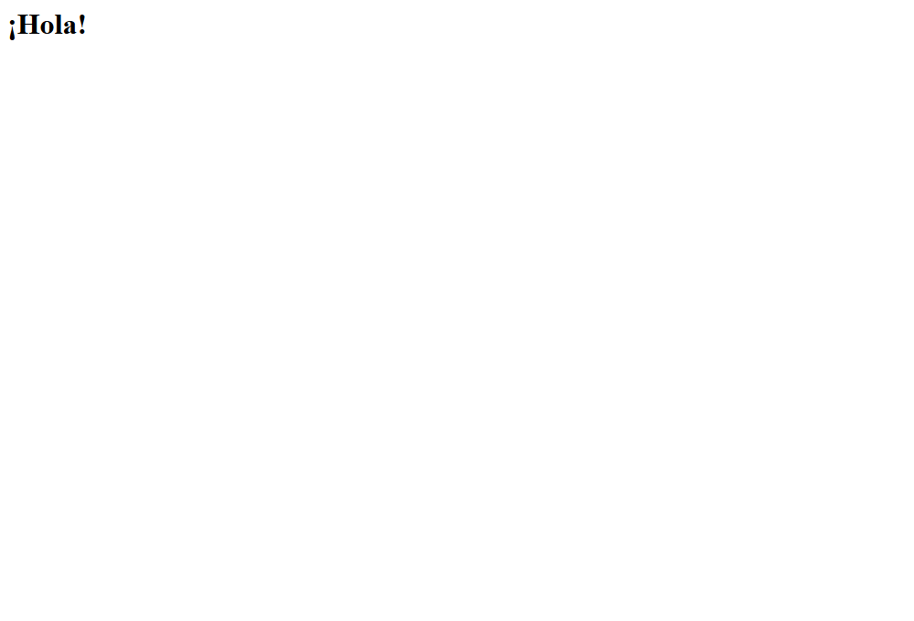

### Ejercicio 7 — Interfaz con tres botones: consola, estilo y alerta

Una misma página con tres botones que hacen cosas distintas, cada una en su función: la primera saca una traza con la hora del sistema, la segunda cambia el texto y el fondo del párrafo de estado, y la tercera abre una ventana modal de aviso.

```html
<button type="button" onclick="consola()">Botón 1 (Consola)</button>
<button type="button" onclick="estilo()">Botón 2 (Estilo)</button>
<button type="button" onclick="alerta()">Botón 3 (Alerta)</button>
```

```js
// Ejercicio 7 - Los tres botones del 1.2·7, cada uno en su función

// El párrafo de estado, que se modificará desde JavaScript.
const estado = document.getElementById('estado');

// Botón 1: traza con la hora del sistema.
function consola() {
  console.log('Hora del sistema: ' + new Date().toLocaleTimeString());
}

// Botón 2: cambia el texto y el fondo del párrafo de estado.
function estilo() {
  estado.innerHTML = 'Sistema Activo';        // contenido
  estado.style.backgroundColor = 'green';     // fondo (camelCase)
}

// Botón 3: ventana emergente modal de aviso.
function alerta() {
  window.alert('El proceso ha concluido.');
}
```

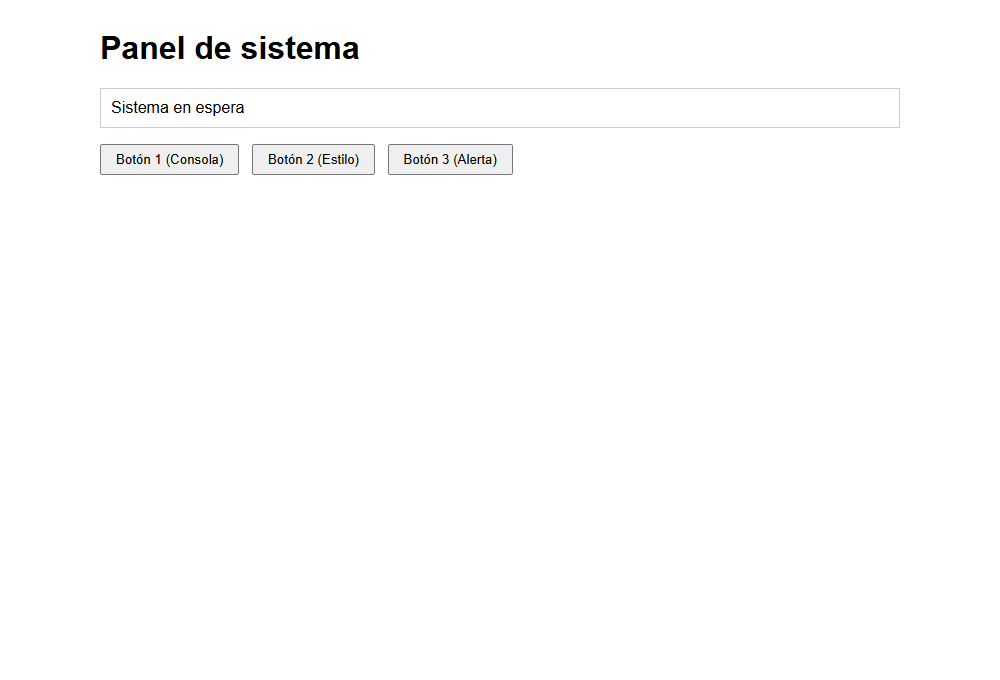

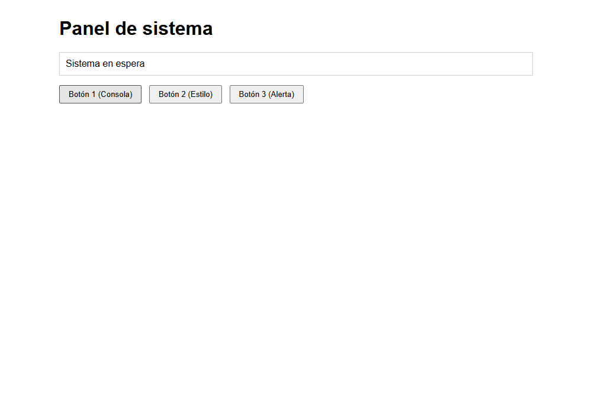

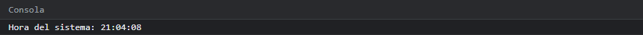

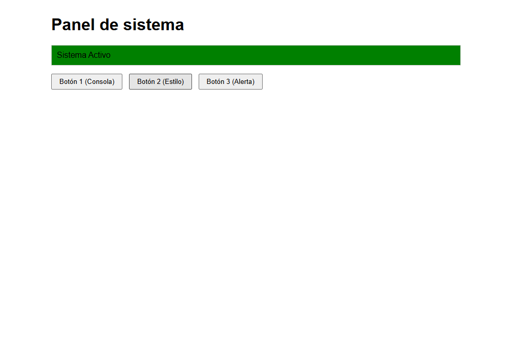

El botón 3 abre la ventana modal con el texto «El proceso ha concluido».

### Ejercicio 8 — Test interactivo de Verdadero/Falso evaluado en el cliente

Test de siete preguntas con botones «Verdadero» y «Falso». Las respuestas correctas se guardan en un array y una única función `responder(numero, elegida)` comprueba la que se ha pulsado, pinta el bloque de verde o rojo y saca la traza del resultado.

```html
<div class="pregunta" id="pregunta1">
  <p>1. JavaScript se ejecuta en el navegador del cliente.</p>
  <button type="button" onclick="responder(1, true)">Verdadero</button>
  <button type="button" onclick="responder(1, false)">Falso</button>
</div>
```

```js
// Ejercicio 8 - El test del 1.2·8 con la lógica metida en una función

// Solución correcta de las 7 preguntas (en el mismo orden que el HTML).
const respuestas = [true, false, true, true, true, true, true];

// Evalúa la respuesta y colorea el bloque según el acierto.
function responder(numero, elegida) {
  const esAcierto = (respuestas[numero - 1] === elegida);
  const div = document.getElementById('pregunta' + numero);

  div.style.color = esAcierto ? 'green' : 'red';
  console.log('[Ej8] Pregunta ' + numero + ': ' + (esAcierto ? 'ACIERTO' : 'ERROR'));
}
```

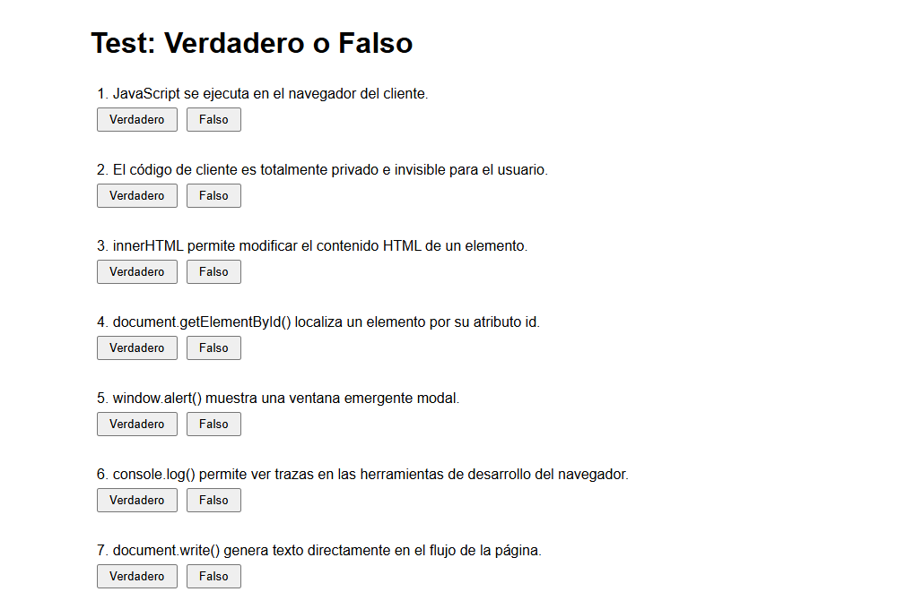

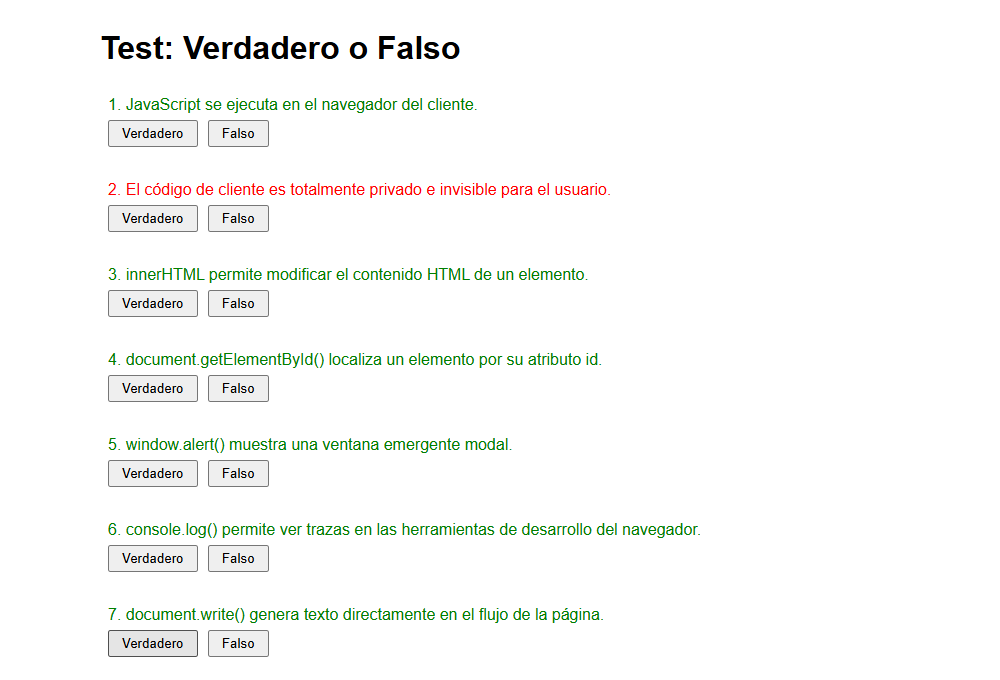

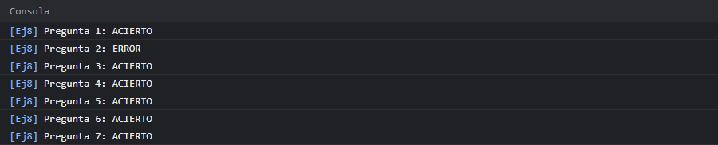

### Ejercicio 9 — Secuencia cíclica de imágenes fotograma a fotograma

Una cinta de cuatro imágenes que avanzan cada vez que se hace clic sobre ellas. La función `siguiente()` calcula el índice del siguiente fotograma con el módulo `%`, de modo que al llegar al último vuelve al primero, y el clic se registra con `addEventListener()` desde el script para dejar el HTML limpio.

```html

```

```js
// Ejercicio 9 - La secuencia de imágenes del 1.2·9 dentro de una función

// Imágenes en formato data: (SVG autocontenido, sin archivos externos).
const colores = ['red', 'green', 'blue', 'orange'];

const imagenes = colores.map(function (color, i) {
  return 'data:image/svg+xml;utf8,' + encodeURIComponent(
    '<svg xmlns="http://www.w3.org/2000/svg" width="240" height="150">' +
    '<rect width="240" height="150" fill="' + color + '"/>' +
    '<text x="120" y="85" font-size="40" fill="white" text-anchor="middle">' + (i + 1) + '</text>' +
    '</svg>'
  );
});

// El índice del fotograma actual.
let indice = 0;

const foto = document.getElementById('foto');
const pie = document.getElementById('pie');

// Primero de la cinta.
function primero() {
  foto.src = imagenes[0];
  pie.innerHTML = 'Fotograma ' + 1 + ' de ' + imagenes.length;
}

// Reasigna .src al siguiente fotograma; el % vuelve al inicio (bucle).
function siguiente() {
  indice = (indice + 1) % imagenes.length;
  foto.src = imagenes[indice];
  pie.innerHTML = 'Fotograma ' + (indice + 1) + ' de ' + imagenes.length;
  console.log('[Ej9] Fotograma ' + (indice + 1) + ' de ' + imagenes.length + ' · índice: ' + indice);
}

// El clic se registra desde el propio script, así el HTML queda limpio.
document.getElementById('foto').addEventListener('click', siguiente);

primero();
```

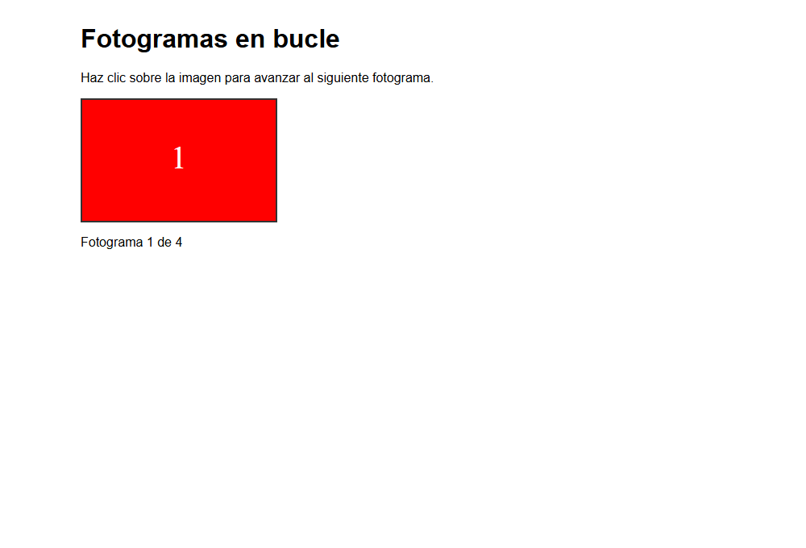

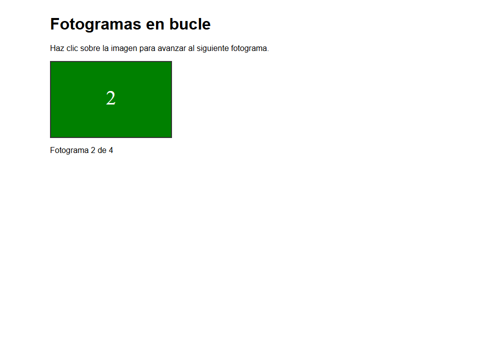

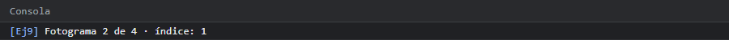

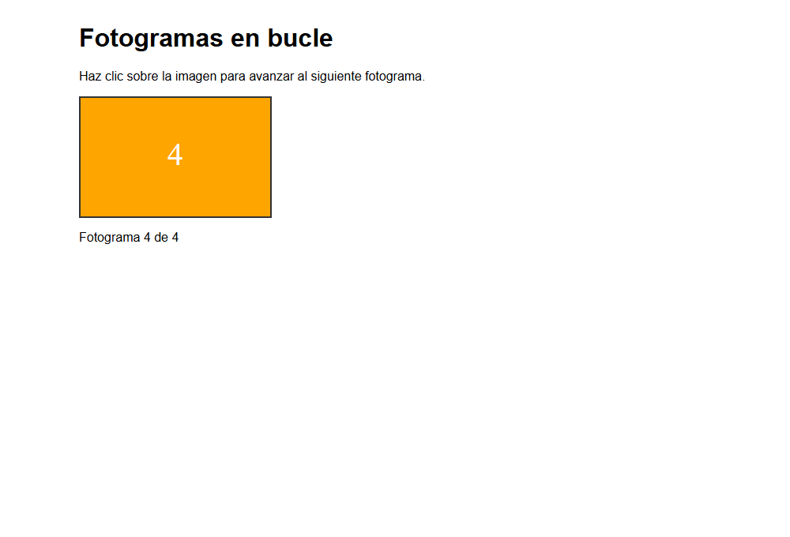
