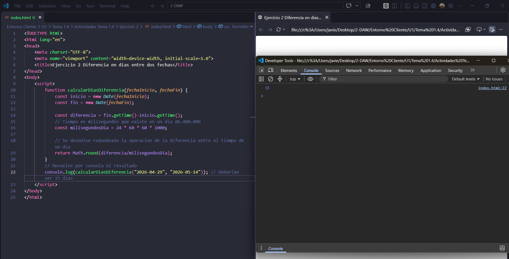
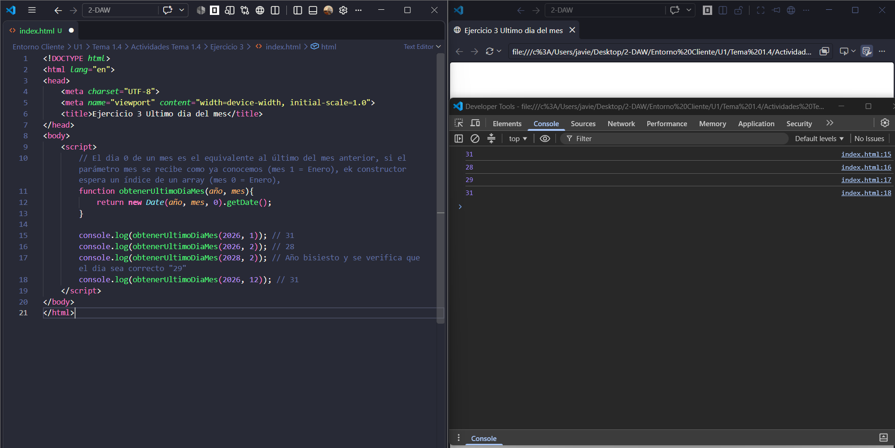
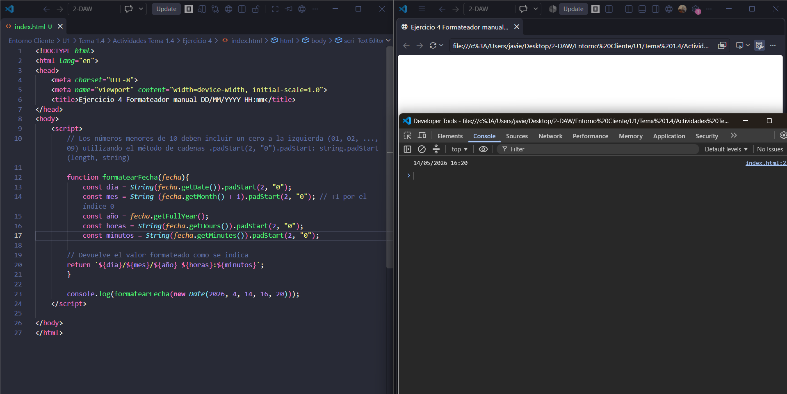
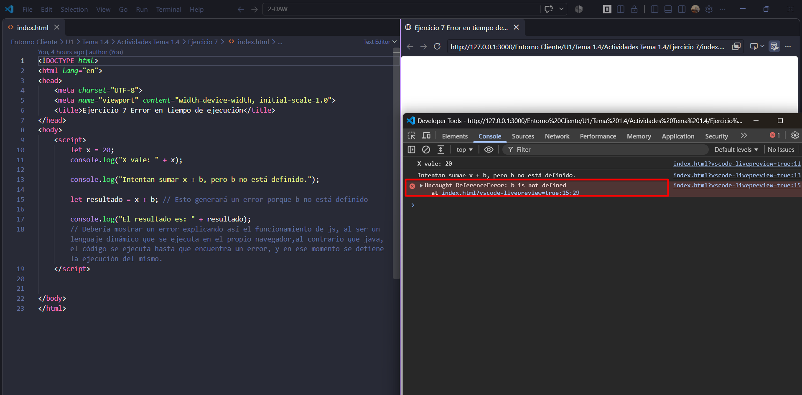

<div align="center">

# Tema 1.4

</div>

# Tema 1.4 · Particularidades de la programación de guiones (scripts) y sus ventajas y desventajas sobre la programación tradicional

## Actividades

### Ejercicio 1 — Interpretación de constructores y desbordamientos

Analiza el siguiente código sin ejecutarlo en la consola y predice exactamente qué fecha representa cada variable:

```js
const fechaA = new Date(2026, 0, 10);
const fechaB = new Date(2026, 12, 1);
const fechaC = new Date(2026);
const fechaD = new Date("2026-02-28");
const fechaE = new Date("2026/02/28");
```

---

### Ejercicio 2 — Cálculo de la diferencia temporal entre dos fechas

Implementa una función llamada `calcularDiasDiferencia(fechaInicio, fechaFin)` que reciba dos cadenas de texto en formato YYYY-MM-DD y devuelva el número entero de días transcurridos entre ambas fechas.

Requisitos:

- Utiliza el cálculo de diferencias en milisegundos mediante `.getTime()`.
- Redondea con `Math.round()` o trunca con `Math.floor()` para evitar inconsistencias con cambios horarios (horario de verano/invierno).



---

### Ejercicio 3 — Calculadora del último día de un mes

Gracias al comportamiento de desbordamiento, pasar el día 0 al constructor permite obtener el último día del mes inmediatamente anterior.

Crea una función `obtenerUltimoDiaMes(año, mes)` donde:

- `mes` se pase en formato humano (1 para enero, 2 para febrero, etc.).
- La función retorne el número entero de días que tiene dicho mes (p. ej., 31, 30, 28 o 29).



---

### Ejercicio 4 — Formateador manual sin librerías

Escribe una función `formatearFechaEspanola(fecha)` que reciba un objeto `Date` y devuelva una cadena con el formato exacto `DD/MM/YYYY HH:mm`.

Condición: los números menores de 10 deben incluir un cero a la izquierda (01, 02, ..., 09) utilizando el método de cadenas `.padStart(2, "0")`.



---

### Ejercicio 5 — Ejercicio teórico comparativo

¿En qué se diferencia técnicamente JavaScript de Java?

Pese a la similitud del nombre, que responde a razones comerciales, son lenguajes distintos:

| Característica | Java | JavaScript |
|---|---|---|
| Categoría | Programación tradicional | Lenguaje de script |
| Traducción | Compilado a bytecode | Interpretado directamente por el motor del navegador |
| Ejecución | Máquina virtual (JVM) | Navegador (o Node.js) |
| Tipado | Fuerte y estático | Débil y dinámico |
| Paradigma | Orientado a objetos basado en clases | Orientado a eventos, basado en prototipos |
| Errores | Se detectan al compilar | Se detectan en tiempo de ejecución |

**En resumen:** Java es un lenguaje compilado y fuertemente tipado que se ejecuta en una máquina virtual, mientras que JavaScript es un lenguaje de script interpretado, dinámico y orientado a eventos, que se ejecuta en el navegador.

---

### Ejercicio 6 — Ejercicio de síntesis de ventajas

Describe las ventajas más importantes de usar JavaScript en el desarrollo web moderno.

- **Sencillez:** sintaxis accesible y curva de aprendizaje rápida.
- **Agilidad de desarrollo:** al ser interpretado no requiere compilar; basta con guardar y recargar la página.
- **Integración con HTML y CSS:** se incrusta en el documento con `<script>` y modifica contenido y estilos mediante el DOM.
- **Portabilidad:** funciona en cualquier dispositivo con un navegador compatible con los estándares.
- **Interactividad sin recargar:** responde a eventos, valida datos en local y actualiza la página de forma parcial (AJAX / `fetch`).
- **Ecosistema:** frameworks y librerías gratuitos (React, Angular, Vue) que aceleran el desarrollo.
- **Un solo lenguaje para cliente y servidor:** gracias a Node.js.
- **Rendimiento:** los motores modernos (V8, SpiderMonkey) usan compilación JIT.

---

### Ejercicio 7 — Actividad de laboratorio

Crea un script sencillo en un archivo `calculo.js` que intente ejecutar una operación matemática con una variable no declarada previamente. Comprueba en el navegador qué sucede: observa cómo las líneas anteriores a la instrucción fallida se ejecutan con normalidad y cómo el intérprete se detiene únicamente al alcanzar el fallo en tiempo de ejecución, comprobando en la consola el error emitido.


