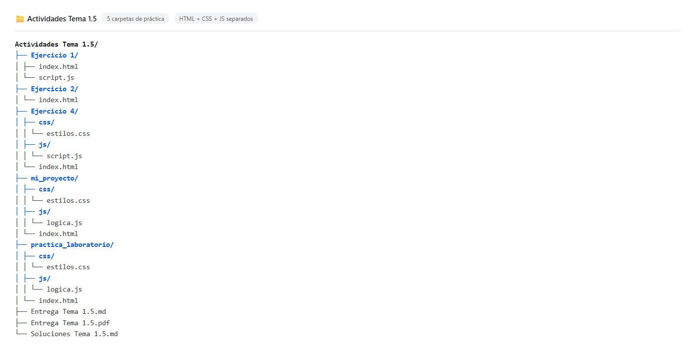
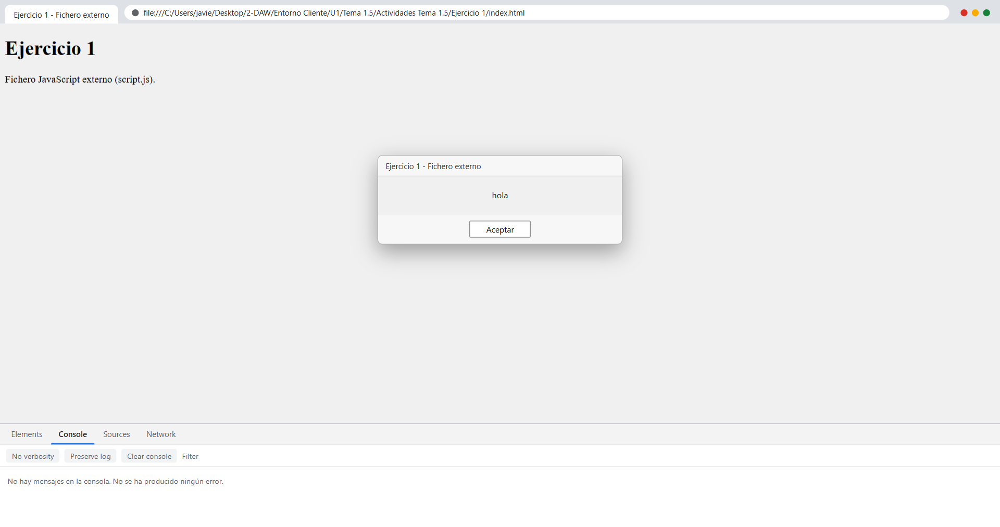
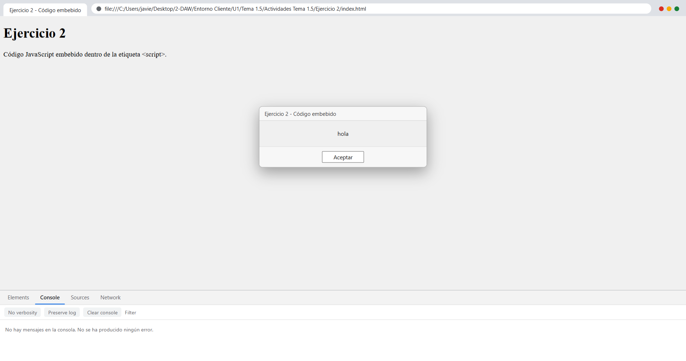
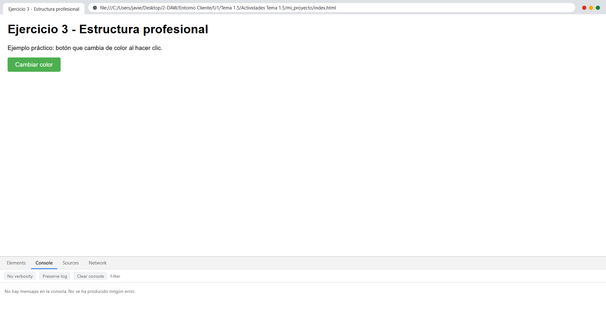
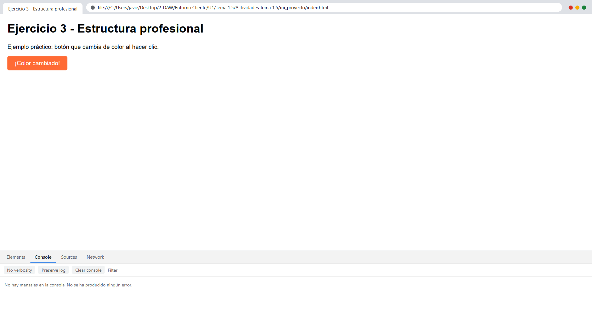
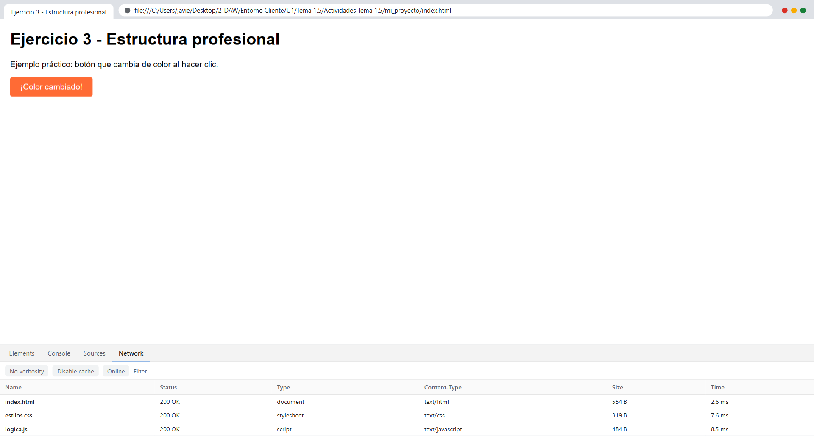
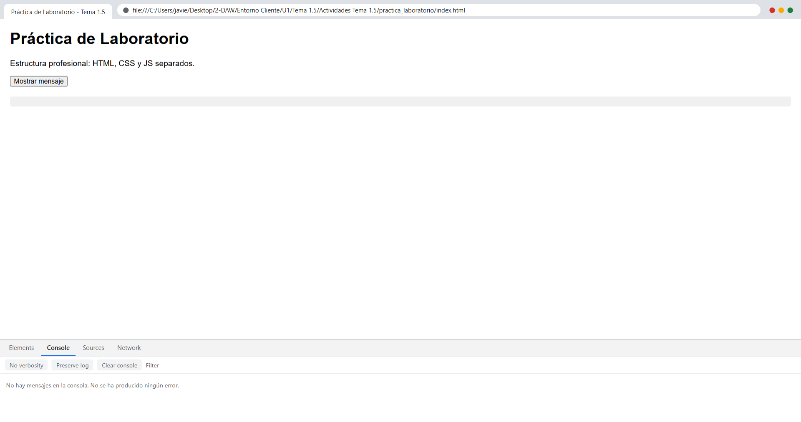
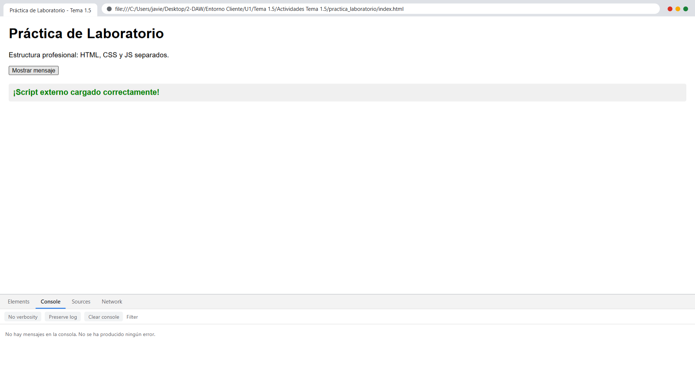
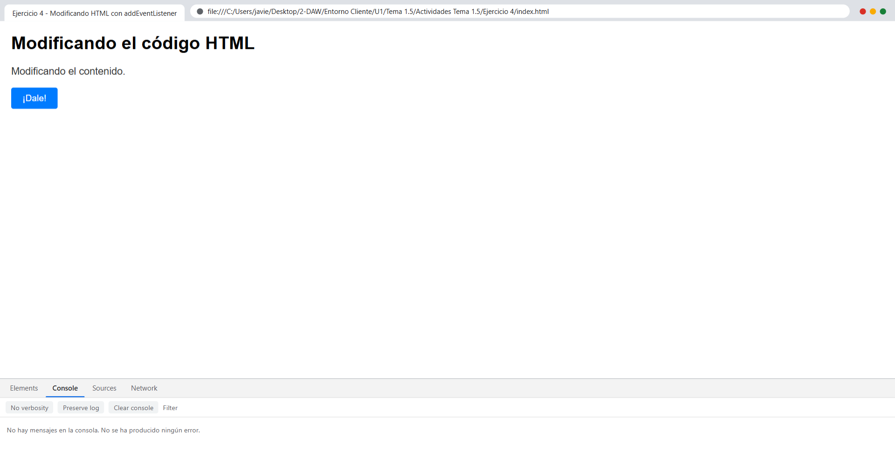
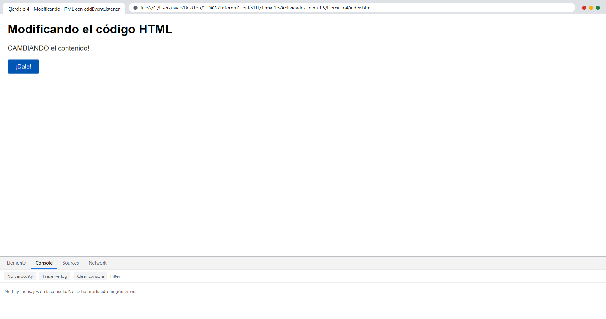

# Tema 1.5

# Tema 1.5 · Verificación de los mecanismos de integración de los lenguajes de marcas con los lenguajes de programación de clientes Web

## Estructura de carpetas

Todas las actividades se han resuelto con una estructura profesional de tres niveles, en la que el HTML, el CSS y el JavaScript viven en ficheros independientes enlazados desde el documento.

---

## Actividades

### Actividad 1 — Integración mediante fichero externo

Crea un archivo llamado `index.html` y otro llamado `script.js` en la misma carpeta utilizando el código de ficheros separados. Ábrelo con un navegador web y comprueba que se muestra el cuadro de alerta con el texto "hola" al cargarse la página.

El documento `index.html` enlaza el fichero mediante la etiqueta `<script src="script.js">`, y el saludo se genera en una función `diAlgo()` que se invoca de forma directa al cargarse el fichero.

Al cargarse la página, el navegador ejecuta `script.js`, aparece el cuadro de alerta con el texto "hola" y la consola del panel de desarrollo permanece sin errores.

**Resultado:** el efecto se consigue porque la etiqueta `<script>` con el atributo `src` recupera el fichero externo y lo evalúa como si el código estuviese escrito dentro del propio documento.

---

### Actividad 2 — Integración mediante script embebido

Crea el archivo `index.html` con el código embebido del apartado 1.5.B. Observa cómo se interrumpe la carga para mostrar el mensaje al navegante.

En este caso el código JavaScript se escribe directamente dentro de una etiqueta `<script>` en el `<head>` del documento, sin ningún fichero externo adicional.

El intérprete se detiene en la instrucción `alert()` hasta que el usuario acepta el cuadro de diálogo, de modo que el resto del documento queda bloqueado hasta entonces.

**Resultado:** ambos mecanismos producen exactamente el mismo efecto ante el usuario; la diferencia está en dónde reside el código, no en su comportamiento.

---

### Práctica de laboratorio guiada — Reorganización del proyecto

1. Diseña una estructura de carpetas profesional: `mi_proyecto/` con `css/estilos.css`, `js/logica.js` e `index.html`.
2. Traslada un bloque de script embebido que cambie el color de un botón a la carpeta `js/logica.js`.
3. Enlaza el archivo desde el `<head>` de `index.html` utilizando la ruta relativa correcta (`./js/logica.js`) y comprueba en la pestaña Network (Red) de las herramientas del desarrollador (F12) que el fichero `.js` devuelve un código de estado 200 OK.

El botón parte de su color original y el script externo, cargado con `addEventListener`, modifica su color y su texto al pulsar.

Tras el clic, el color del botón pasa de verde a naranja y el texto confirma el cambio, lo que demuestra que el JavaScript externo se está ejecutando correctamente.

**Comprobación en la pestaña Red (F12):** las tres peticiones del documento se resuelven con código de estado 200 OK, tal y como exige el enunciado.

| Fichero | Tipo | Estado | Tipo MIME | Tamaño | Tiempo |
|---|---|---|---|---|---|
| `index.html` | document | 200 OK | text/html | 554 B | 3,5 ms |
| `estilos.css` | stylesheet | 200 OK | text/css | 319 B | 7,0 ms |
| `logica.js` | script | 200 OK | text/javascript | 484 B | 8,0 ms |

---

### Actividad complementaria — Práctica de laboratorio

Repite el ejercicio con una segunda estructura profesional, `practica_laboratorio/`, que sigue la misma organización de carpetas y enlaza `./css/estilos.css` y `./js/logica.js` desde el documento.

Al pulsar el botón, el script externo escribe el mensaje en el documento y lo muestra en verde y negrita, confirmando que el fichero se ha cargado y ejecutado.

---

### Reorganización de los ejercicios con la estructura anterior

El enunciado del módulo pide «realiza los ejercicios del apartado 1.2 haciendo uso de la estructura anterior». El material no contiene un apartado 1.2, ya que el tema se articula únicamente en los apartados **A** (la etiqueta `<script>` y su evolución técnica) y **B** (código JavaScript en ficheros externos separados), por lo que se trata de una errata de referencia.

La interpretación correcta, y la que se ha aplicado, consiste en resolver los ejercicios del tema utilizando la estructura profesional de carpetas en lugar de dejar el JavaScript embebido. Las dos últimas prácticas de esta entrega atienden a ese propósito: repiten la mecánica del botón interactivo sobre la estructura `mi_proyecto/` y sobre `practica_laboratorio/`.

El mismo ejercicio resuelto dentro de una carpeta con sus subdirectorios `css/` y `js/`, mostrando el cambio de estado del botón al ser pulsado.

---

## Resumen de verificaciones

| Actividad | Comprobación | Resultado |
|---|---|---|
| Actividad 1 | Cuadro de alerta con el texto "hola" al cargar la página | Correcto, diálogo capturado con el mensaje `hola` |
| Actividad 1 | Consola del panel de desarrollo | Sin mensajes y sin errores |
| Actividad 2 | El script embebido interrumpe la carga para mostrar el mensaje | Correcto, diálogo capturado con el mensaje `hola` |
| Actividad 2 | Consola del panel de desarrollo | Sin mensajes y sin errores |
| Práctica guiada | `index.html`, `estilos.css` y `logica.js` en la pestaña Red | 200 OK en las tres peticiones |
| Práctica guiada | Cambio de color del botón con JavaScript externo | Correcto, de `rgb(76, 175, 80)` a `rgb(255, 107, 53)` |
| Práctica de laboratorio | Escritura del mensaje en el documento | Correcto, el mensaje pasa de vacío a «¡Script externo cargado correctamente!» |
| Todas | Excepciones de JavaScript | Ninguna registrada en ninguna práctica |
